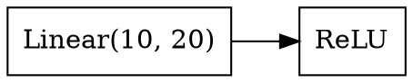

# VODE

A comprehensive visualization and debugging tool for Python execution and PyTorch neural networks.

## Overview

VODE provides two powerful capabilities:

- **Execution Tracing**: Capture and visualize function call trees for any Python code
- **Neural Network Visualization**: Dual-graph visualization of PyTorch model architecture and dataflow

## Features

### Execution Tracing

- Zero-code modification tracing using `sys.settrace()`
- Function call tree capture with parent-child relationships
- Parameter and return value recording
- Dataflow edge resolution by object ID matching
- PyTorch tensor metadata extraction (shape, dtype, device, stats)
- Interactive web visualization

### Neural Network Visualization

- **Dual-graph architecture**: Separate structure and dataflow graphs
- **Structure graph**: Captures model architecture during initialization
- **Dataflow graph**: Captures tensor operations during forward pass
- **Horizontal layout**: INPUT-OP-OUTPUT node design for clear dataflow
- **Interactive inspection**: Click nodes to view detailed tensor statistics
- **Multiple formats**: Export to SVG, PNG, PDF, or view in browser
- **Graphviz storage**: Extensible .gv format for custom processing

## Installation

**Requirements**: Python 3.10+

```bash
cd vode
pip install -e .
```

**Optional**: Install PyTorch for neural network visualization.

## Quick Start

### Command-Line Interface (CLI)

VODE provides a CLI for quick model visualization from Python scripts:

```bash
# Install vode first
cd vode
pip install -e .

# Basic usage - visualize models in a script
vode script.py

# With options
vode --mode static --format svg --output model.svg script.py
vode -m static -f png -o model.png script.py

# Control visualization depth
vode --depth 3 script.py

# Pass arguments to your script
vode script.py --layers 5 --hidden 128

# Disable loop collapsing
vode --no-collapse-loops script.py
```

CLI Options:

- `--mode, -m`: Visualization mode ('static' or 'dynamic', default: 'static')
- `--format, -f`: Output format ('svg', 'png', 'pdf', 'gv', default: 'svg')
- `--output, -o`: Output file path (default: auto-generated from script name)
- `--depth, -d`: Maximum depth for visualization (default: None = full depth)
- `--collapse-loops`: Collapse loop patterns (default: True)
- `--no-collapse-loops`: Don't collapse loop patterns
- `--model-name`: Variable name of model to visualize (default: auto-detect)

The CLI automatically detects PyTorch models created in your script and visualizes them.

### Python API (All-in-One)

```python
from vode.visualize import vode
import torch
import torch.nn as nn

# Define your model
model = nn.Sequential(
    nn.Linear(10, 20),
    nn.ReLU(),
    nn.Linear(20, 10)
)

# Static capture (no input needed)
vode(model, mode='static', output='model.svg')

# Dynamic capture (with input to capture tensor shapes)
x = torch.randn(1, 10)
vode(model, x, mode='dynamic', output='model_dynamic.svg', compute_stats=True)

# Control depth for large models
vode(model, mode='static', output='model_d3.svg', max_depth=3)
```

### Advanced Usage (Separate Capture and Visualization)

```python
from vode.capture import capture_static, capture_dynamic
from vode.visualize import visualize
import torch
import torch.nn as nn

# Define model
model = nn.Sequential(
    nn.Conv2d(3, 64, 3),
    nn.ReLU(),
    nn.MaxPool2d(2),
    nn.Linear(64, 10)
)

# Static capture
graph = capture_static(model)
visualize(graph, output_path='static.svg', max_depth=5)

# Dynamic capture with tensor metadata
x = torch.randn(1, 3, 224, 224)
graph = capture_dynamic(model, x, compute_stats=True)
visualize(graph, output_path='dynamic.svg', format='png')
```

## API Reference

### Main Functions

**`vode(model, *args, mode='static', output='model.svg', **options)`**

All-in-one function for capture and visualization.

Parameters:

- `model` (nn.Module): PyTorch model to visualize
- `*args`: Input tensors (required for dynamic mode)
- `mode` (str): 'static' or 'dynamic'
- `output` (str): Output file path
- `max_depth` (int|None): Maximum depth to render (None for full tree)
- `format` (str): 'svg', 'png', 'pdf', or 'gv'
- `rankdir` (str): 'LR' (left-right) or 'TB' (top-bottom)
- `collapse_loops` (bool): Whether to collapse loop nodes
- `compute_stats` (bool): Compute tensor statistics (dynamic mode only)

Returns: Path to generated file

**`capture_static(model)`**

Capture model structure without running forward pass.

Parameters:

- `model` (nn.Module): PyTorch model

Returns: ComputationGraph with module hierarchy

**`capture_dynamic(model, *args, compute_stats=False, **kwargs)`**

Capture model execution with sample inputs.

Parameters:

- `model` (nn.Module): PyTorch model
- `*args`: Sample inputs for forward pass
- `compute_stats` (bool): Compute tensor statistics (min, max, mean, std)
- `**kwargs`: Additional keyword arguments for forward pass

Returns: ComputationGraph with runtime execution data

**`visualize(graph, output_path, max_depth=None, format='svg', rankdir='LR', collapse_loops=True)`**

Render computation graph to file.

Parameters:

- `graph` (ComputationGraph): Graph to visualize
- `output_path` (str): Output file path
- `max_depth` (int|None): Maximum depth to render
- `format` (str): Output format ('svg', 'png', 'pdf', 'gv')
- `rankdir` (str): Graph direction ('LR' or 'TB')
- `collapse_loops` (bool): Whether to collapse loop nodes

Returns: Path to generated file

## Usage Examples

### Depth Control for Large Models

```python
from vode.visualize import vode

# Full model (all modules)
vode(large_model, mode='static', output='full.svg')

# High-level view (depth 3)
vode(large_model, mode='static', output='overview.svg', max_depth=3)

# Medium detail (depth 5)
vode(large_model, mode='static', output='detail.svg', max_depth=5)
```

### Tensor Statistics

```python
from vode.capture import capture_dynamic
from vode.visualize import visualize

# Capture with statistics
x = torch.randn(1, 3, 224, 224)
graph = capture_dynamic(model, x, compute_stats=True)

# Graph now contains min, max, mean, std for each tensor
visualize(graph, 'model_with_stats.svg')
```

### Different Output Formats

```python
from vode.visualize import vode

# SVG (vector, scalable)
vode(model, mode='static', output='model.svg')

# PNG (raster, for presentations)
vode(model, mode='static', output='model.png')

# PDF (vector, for papers)
vode(model, mode='static', output='model.pdf')

# Graphviz source (for custom processing)
vode(model, mode='static', output='model.gv', format='gv')
```

### Loop Detection

```python
import torch.nn as nn
from vode.visualize import vode

# Sequential is detected as a loop
model = nn.Sequential(
    nn.Linear(10, 20),
    nn.ReLU(),
    nn.Linear(20, 10)
)

# Collapsed view (default)
vode(model, mode='static', output='collapsed.svg', collapse_loops=True)

# Expanded view (show all iterations)
vode(model, mode='static', output='expanded.svg', collapse_loops=False)
```

## Architecture

```
vode/
├── capture/
│   ├── static_capture.py    # Static model structure capture
│   └── dynamic_capture.py   # Dynamic execution capture
├── core/
│   ├── graph.py             # ComputationGraph data structure
│   ├── nodes.py             # Node types (Module, Tensor, Loop)
│   └── utils.py             # Utility functions
├── visualize/
│   ├── visualizer.py        # Main visualization logic
│   ├── graphviz_renderer.py # Graphviz rendering
│   └── vode_wrapper.py      # All-in-one API
└── __init__.py              # Public API exports
```

## Output Format

### Graphviz (.gv) Files

VODE generates Graphviz files that can be:

- Rendered to SVG/PNG/PDF using Graphviz
- Edited manually for custom styling
- Processed by other tools

Example structure:



### Node Information

**ModuleNode** (captured in both modes):

- Module type (Linear, Conv2d, etc.)
- Parameter count (total and trainable)
- Depth in hierarchy
- Parent-child relationships

**TensorNode** (dynamic mode only):

- Shape (e.g., [1, 3, 224, 224])
- Dtype (torch.float32, etc.)
- Device (cpu, cuda:0, etc.)
- Optional statistics (min, max, mean, std)

**LoopNode** (detected automatically):

- Loop type (sequential, modulelist, recursive)
- Iteration count
- Body node IDs

## Limitations and Known Issues

### Current Limitations

1. **Dynamic capture requires forward pass**: Model must be executable with provided inputs
2. **No gradient tracking**: Uses `torch.no_grad()` for performance
3. **Memory overhead**: Large models with many tensors may consume significant memory
4. **Graphviz rendering**: Very large graphs (>10k nodes) may be slow to render

### Known Issues

1. **Module name parsing**: Some complex module names may be sanitized for Graphviz compatibility
2. **Tensor statistics**: Not all dtypes support min/max/mean/std operations
3. **Recursive modules**: Deep recursion may create very large graphs

### Workarounds

- **Large models**: Use `max_depth` parameter to limit visualization depth
- **Memory issues**: Use static mode instead of dynamic mode
- **Slow rendering**: Export to .gv format and render separately

## Testing

VODE has been tested on:

- Simple models (Sequential, custom modules)
- Complex models (ResNet, Transformer, Diffusion models)
- Large models (4000+ modules, tested on LatentVisualDiffusion)
- Various input types (tensors, tuples, dicts)

Test results show successful capture and visualization across all tested scenarios.

## Future Work

- [ ] Interactive web viewer for large graphs
- [ ] Gradient flow visualization
- [ ] Performance profiling integration
- [ ] Support for other frameworks (TensorFlow, JAX)
- [ ] Automatic layout optimization for large graphs
- [ ] Diff visualization (compare two models)

## License

MIT License

## Contributing

Contributions welcome! Areas of interest:

- Performance optimization for large models
- Additional output formats
- Better loop detection heuristics
- Documentation improvements
