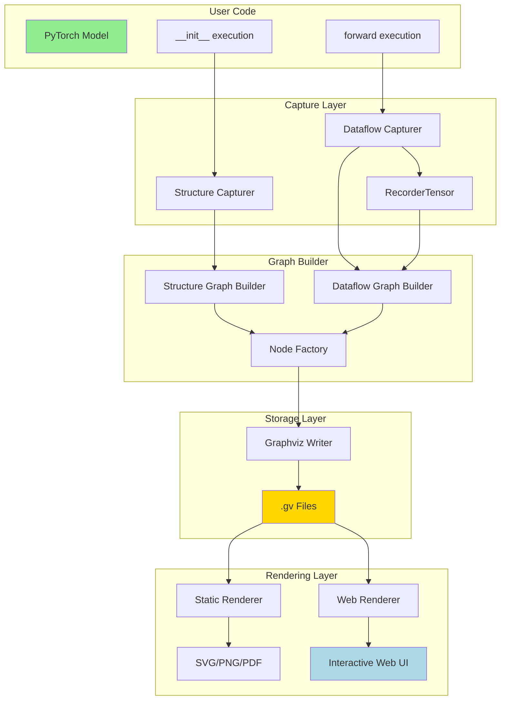
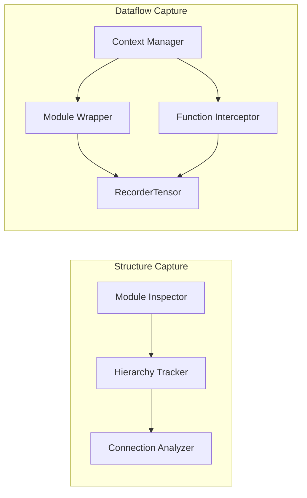
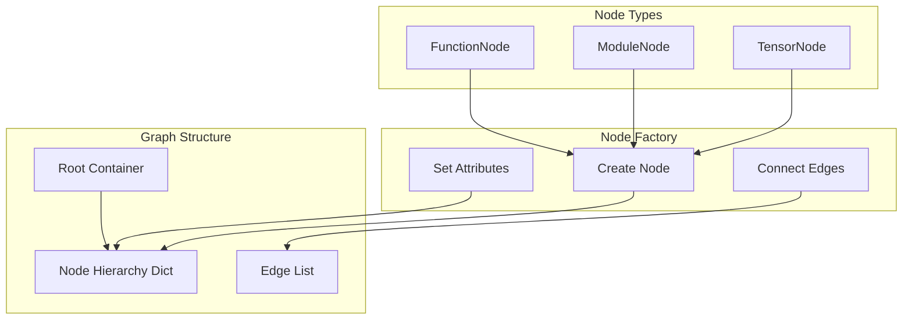
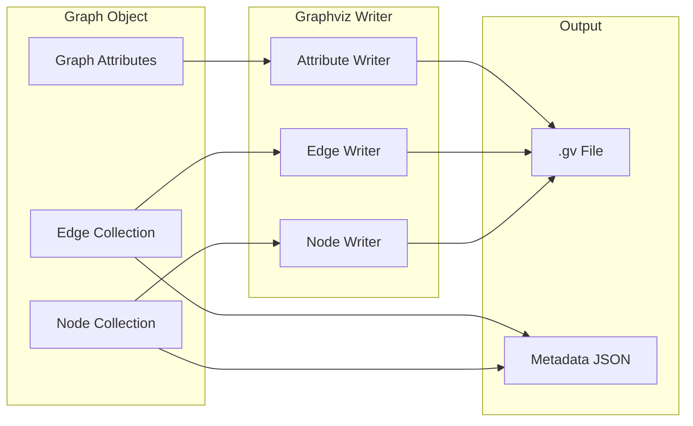
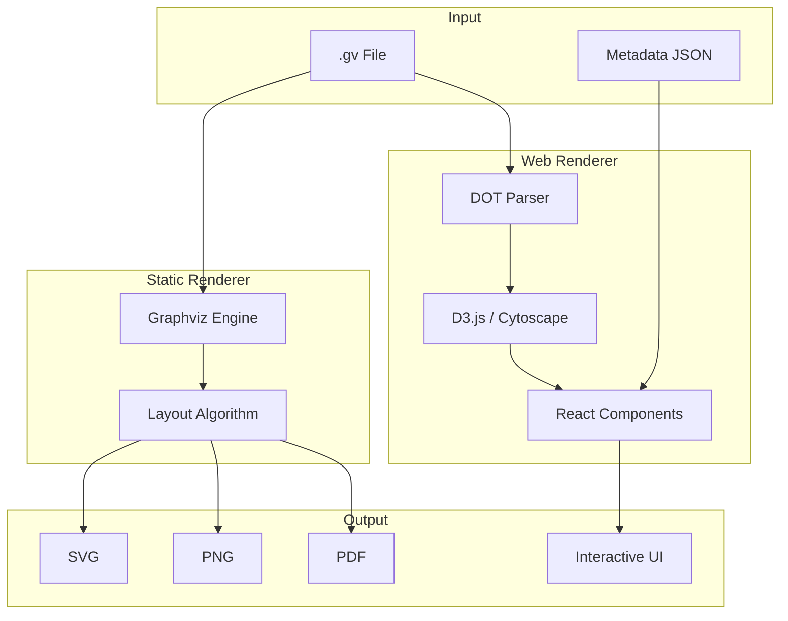
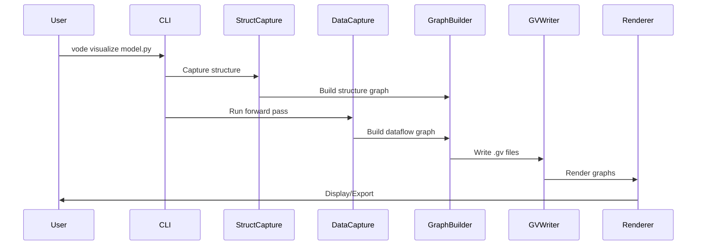

# VODE Stage 3: System Architecture

## Overview

VODE Stage 3 implements a dual-graph neural network visualization system with two capture modes and multiple rendering backends.

## High-Level Architecture



## Component Architecture

### 1. Capture Layer



**Structure Capture** (during `__init__`):

- Inspects module hierarchy via `named_modules()`
- Tracks parent-child relationships
- Identifies layer types and parameters

**Dataflow Capture** (during `forward`):

- Uses RecorderTensor subclass
- Wraps `nn.Module.__call__`
- Intercepts `__torch_function__`
- Operates within context manager scope

### 2. Graph Builder Layer



**Node Types**:

- **TensorNode**: Represents tensors (input/output/intermediate)
- **ModuleNode**: Represents nn.Module instances
- **FunctionNode**: Represents torch functions (relu, cat, etc.)

**Graph Structure**:

- Root container holds input nodes
- Hierarchy dict maintains parent-child relationships
- Edge list stores all connections

### 3. Storage Layer (Graphviz Format)



**Graphviz Format Benefits**:

- Text-based, diff-friendly
- Extensible with custom attributes
- Multiple output formats (SVG, PNG, PDF)
- Industry standard

### 4. Rendering Layer



## Source Code Structure

```
vode/src/vode/
├── nn/                          # NEW: Neural network visualization
│   ├── __init__.py
│   ├── capture/                 # Capture mechanisms
│   │   ├── __init__.py
│   │   ├── recorder_tensor.py   # RecorderTensor subclass
│   │   ├── structure_capture.py # Structure graph capture
│   │   ├── dataflow_capture.py  # Dataflow graph capture
│   │   └── context.py           # Context manager
│   ├── graph/                   # Graph building
│   │   ├── __init__.py
│   │   ├── nodes.py             # Node classes
│   │   ├── builder.py           # Graph builder
│   │   └── hierarchy.py         # Hierarchy management
│   ├── storage/                 # Storage layer
│   │   ├── __init__.py
│   │   ├── graphviz_writer.py   # .gv file writer
│   │   └── metadata.py          # Metadata extraction
│   └── render/                  # Rendering layer
│       ├── __init__.py
│       ├── static.py            # Static rendering (SVG/PNG/PDF)
│       └── web.py               # Web rendering utilities
├── view/                        # Existing web viewer
│   ├── frontend/                # React frontend
│   │   └── src/
│   │       ├── components/
│   │       │   ├── StructureView.tsx    # NEW
│   │       │   ├── DataflowView.tsx     # Enhanced
│   │       │   └── NodeInspector.tsx    # NEW
│   │       └── utils/
│   │           └── graphviz_parser.ts   # NEW
│   └── server.py                # Enhanced API
└── cli.py                       # Enhanced CLI
```

## Data Flow



## Key Design Patterns

### 1. Context Manager Pattern

```python
with DataflowCapture(model) as capture:
    output = model(input_data)
    graph = capture.get_graph()
```

### 2. Visitor Pattern

```python
class NodeVisitor:
    def visit_tensor_node(self, node): ...
    def visit_module_node(self, node): ...
    def visit_function_node(self, node): ...
```

### 3. Builder Pattern

```python
builder = GraphBuilder()
builder.add_node(node)
builder.add_edge(src, dst)
graph = builder.build()
```

## Extensibility Points

1. **Custom Node Types**: Add new node classes inheriting from `Node`
2. **Custom Attributes**: Extend metadata extraction
3. **Custom Renderers**: Implement new rendering backends
4. **Custom Layouts**: Add layout algorithms for different use cases

## Performance Considerations

- **Lazy Evaluation**: Build graphs on-demand
- **Streaming**: Write .gv files incrementally
- **Caching**: Cache parsed graphs for web rendering
- **Filtering**: Support depth/pattern filtering to reduce graph size
