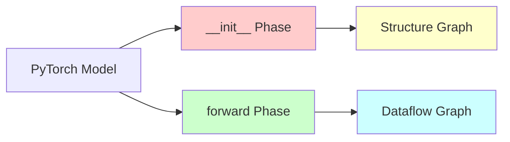
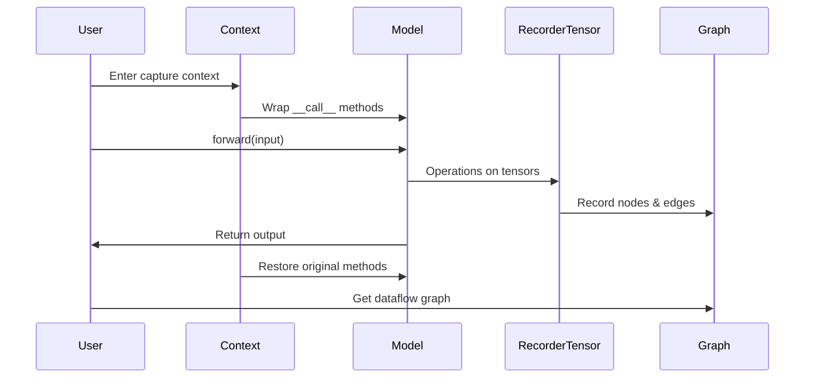

# VODE Stage 3: Capture Mechanism

## Overview

VODE Stage 3 implements two distinct capture mechanisms:

1. **Structure Capture**: During `__init__` to build model architecture graph
2. **Dataflow Capture**: During `forward()` to track tensor operations

## Dual-Graph Strategy



## Structure Capture (Init Phase)

### Goal

Capture the static architecture of the model - module hierarchy, layer types, and connections.

### Mechanism

**Approach**: Introspection via `named_modules()` and `named_children()`

```python
class StructureCapture:
    def capture(self, model: nn.Module) -> StructureGraph:
        """Capture model structure during/after initialization"""
        graph = StructureGraph()
        
        # Traverse module hierarchy
        for name, module in model.named_modules():
            depth = name.count('.') + 1
            node = ModuleNode(
                name=name,
                module_type=type(module).__name__,
                depth=depth
            )
            graph.add_node(node)
        
        # Build parent-child relationships
        for name, module in model.named_modules():
            for child_name, child in module.named_children():
                full_child_name = f"{name}.{child_name}" if name else child_name
                graph.add_edge(name, full_child_name)
        return graph
```

### Characteristics

- **Non-invasive**: No modification to model code
- **Static analysis**: Runs once after initialization
- **Lightweight**: Fast traversal of module tree
- **Complete**: Captures all modules regardless of execution path

### Example Output

```python
# Structure graph for simple CNN
StructureGraph(
    nodes=[
        ModuleNode(name='', type='SimpleCNN', depth=0),
        ModuleNode(name='conv1', type='Conv2d', depth=1),
        ModuleNode(name='relu', type='ReLU', depth=1),
        ModuleNode(name='fc', type='Linear', depth=1),
    ],
    edges=[
        ('', 'conv1'),
        ('', 'relu'),
        ('', 'fc'),
    ]
)
```

## Dataflow Capture (Forward Phase)

### Goal

Capture dynamic tensor operations during forward pass - actual data flow, shapes, and transformations.

### Mechanism

**Approach**: RecorderTensor pattern inspired by torchview



### Core Components

#### 1. RecorderTensor Subclass

```python
class RecorderTensor(torch.Tensor):
    """Tensor subclass that records operations"""
    
    def __init__(self, tensor: torch.Tensor, node: TensorNode):
        self.tensor_nodes = [node]
    
    @classmethod
    def __torch_function__(cls, func, types, args=(), kwargs=None):
        """Intercept all torch operations"""
        # Create function node
        func_node = FunctionNode(func, depth, parent_nodes)
        
        # Execute original function
        result = super().__torch_function__(func, types, args, kwargs)
        
        # Attach output node
        output_node = TensorNode(result, depth, func_node)
        
        return result
```

#### 2. Module Call Wrapper

```python
def module_forward_wrapper(graph: DataflowGraph):
    def wrapper(module: nn.Module, *args, **kwargs):
        # Extract input RecorderTensors
        input_nodes = collect_tensor_nodes(args, kwargs)
        
        # Create module node
        module_node = ModuleNode(module, depth, input_nodes)
        
        # Call original forward
        output = _orig_forward(module, *args, **kwargs)
        
        # Process output nodes
        output_nodes = collect_tensor_nodes(output)
        module_node.set_outputs(output_nodes)
        
        return output
    return wrapper
```

#### 3. Context Manager

```python
class DataflowCapture:
    def __init__(self, model: nn.Module):
        self.model = model
        self.graph = DataflowGraph()
    
    def __enter__(self):
        # Save original methods
        self._orig_call = nn.Module.__call__
        
        # Replace with wrapper
        nn.Module.__call__ = module_forward_wrapper(self.graph)
        
        return self
    
    def __exit__(self, *args):
        # Restore original methods
        nn.Module.__call__ = self._orig_call
    
    def get_graph(self) -> DataflowGraph:
        return self.graph
```

### Usage Example

```python
model = ResNet50()
input_data = torch.randn(1, 3, 224, 224)

# Capture dataflow
with DataflowCapture(model) as capture:
    output = model(input_data)
    dataflow_graph = capture.get_graph()

# Save to graphviz
dataflow_graph.to_graphviz('resnet50_dataflow.gv')
```

### Characteristics

- **Dynamic**: Captures actual execution path
- **Shape-aware**: Records tensor shapes at runtime
- **Temporary**: Wrappers active only during capture
- **Complete**: Captures all operations in forward pass

## Avoiding Initialization Capture

**Problem**: Don't want to capture `__init__` execution, only `forward()`.

**Solution**: Apply wrappers AFTER initialization, BEFORE forward pass.

```python
# CORRECT: Capture only forward pass
model = MyModel()  # __init__ runs normally
with DataflowCapture(model) as capture:
    output = model(input_data)  # Only this is captured

# WRONG: Would capture initialization
with DataflowCapture(MyModel) as capture:
    model = MyModel()  # This would be captured (bad!)
```

## Depth Tracking

Both capture mechanisms track hierarchy depth:

```python
depth = 0  # Top-level model
depth = 1  # First-level submodules
depth = 2  # Second-level submodules
depth = 3  # Atomic operations (lowest level)
```

**Depth threshold**: Operations at depth ≥ 3 are considered "low-level" and display shapes.

## Comparison: Structure vs Dataflow

| Aspect | Structure Capture | Dataflow Capture |
|--------|------------------|------------------|
| **When** | After `__init__` | During `forward()` |
| **What** | Module hierarchy | Tensor operations |
| **How** | Introspection | RecorderTensor |
| **Scope** | All modules | Executed path only |
| **Cost** | Very low | Moderate |
| **Dynamic** | No | Yes |

## Implementation Considerations

### 1. Memory Management

- RecorderTensors hold references to nodes
- Clear references after graph construction
- Use weak references where appropriate

### 2. Performance

- Dataflow capture adds ~10-20% overhead
- Structure capture is negligible
- Consider sampling for very large models

### 3. Thread Safety

- Context manager is not thread-safe
- Use separate captures for parallel execution
- Consider locks for shared graph objects

### 4. Error Handling

- Restore original methods even on exception
- Use try-finally in context manager
- Validate graph consistency after capture

## Advanced Features

### Conditional Execution

Handle models with conditional branches:

```python
class ConditionalModel(nn.Module):
    def forward(self, x, use_branch_a=True):
        if use_branch_a:
            return self.branch_a(x)
        else:
            return self.branch_b(x)

# Capture both paths
with DataflowCapture(model) as capture:
    out_a = model(x, use_branch_a=True)
    out_b = model(x, use_branch_a=False)
```

### Recursive Modules

Handle RNNs and recursive structures:

```python
# Detect recursion by module ID
if module_id in visited_modules:
    # Mark as recursive reference
    node.is_recursive = True
```

## Summary

VODE's dual capture strategy provides:

- **Complete architecture** via structure capture
- **Actual execution** via dataflow capture
- **Clean separation** between static and dynamic analysis
- **Minimal overhead** through temporary instrumentation
