# VODE Stage 3: Data Format Specification

## Overview

VODE uses Graphviz DOT format (.gv) for storing both structure and dataflow graphs. This format is text-based, extensible, and supports multiple rendering backends.

## Graphviz DOT Format Basics

```dot
strict digraph ModelName {
    graph [attributes]
    node [default_attributes]
    edge [default_attributes]
    
    node_id [label="..." attributes]
    node_id1 -> node_id2 [attributes]
}
```

## Graph-Level Attributes

```dot
graph [
    ordering=in,
    rankdir=LR,           # Left to Right layout
    size="20,20",
    bgcolor=white,
    splines=ortho         # Orthogonal edges
]
```

**Key Attributes**:

- `rankdir`: Graph direction (LR=horizontal, TB=vertical)
- `ordering=in`: Preserve input order
- `splines`: Edge routing style (ortho, curved, line)

## Node Attributes

### Common Node Attributes

```dot
node [
    style=filled,
    shape=plaintext,      # Allows HTML labels
    fontsize=10,
    fontname="Arial",
    margin=0
]
```

### Node Types and Colors

```python
NODE_COLORS = {
    'tensor': 'lightyellow',      # #FFFFE0
    'module': 'darkseagreen1',    # #C1FFC1
    'function': 'aliceblue',      # #F0F8FF
    'input': 'lightblue',         # #ADD8E6
    'output': 'lightcoral'        # #F08080
}
```

## Node Label Format (HTML Tables)

VODE uses HTML-like tables in Graphviz for flexible node layouts.

### Low-Level Operation Node (with shapes)

```dot
0 [label=<
    <TABLE BORDER="0" CELLBORDER="1" CELLSPACING="0" CELLPADDING="4">
    <TR>
        <TD ROWSPAN="2" BGCOLOR="#E8E8E8">
            <TABLE BORDER="0" CELLBORDER="0" CELLSPACING="2">
                <TR><TD>●</TD></TR>
                <TR><TD>●</TD></TR>
            </TABLE>
        </TD>
        <TD COLSPAN="2">Conv2d<BR/>depth: 3</TD>
        <TD ROWSPAN="2" BGCOLOR="#E8E8E8">
            <TABLE BORDER="0" CELLBORDER="0" CELLSPACING="2">
                <TR><TD>●</TD></TR>
            </TABLE>
        </TD>
    </TR>
    <TR>
        <TD>in: (1,3,224,224)</TD>
        <TD>out: (1,32,224,224)</TD>
    </TR>
    </TABLE>
> fillcolor=darkseagreen1]
```

**Visual Result**:

```text
┌───┬─────────────────────┬───┐
│ ● │     Conv2d          │ ● │
│ ● │     depth: 3        │   │
│   ├──────────┬──────────┤   │
│   │in: (1,3, │out: (1,  │   │
│   │224,224)  │32,224,224│   │
└───┴──────────┴──────────┴───┘
```

### High-Level Function Node (no shapes)

```dot
1 [label=<
    <TABLE BORDER="0" CELLBORDER="1" CELLSPACING="0" CELLPADDING="4">
    <TR>
        <TD ROWSPAN="2" BGCOLOR="#E8E8E8">INPUT</TD>
        <TD COLSPAN="2">compute_loss<BR/>depth: 1</TD>
        <TD ROWSPAN="2" BGCOLOR="#E8E8E8">OUTPUT</TD>
    </TR>
    </TABLE>
> fillcolor=darkseagreen1]
```

**Visual Result**:

```text
┌───────┬──────────────┬────────┐
│ INPUT │ compute_loss │ OUTPUT │
│       │   depth: 1   │        │
└───────┴──────────────┴────────┘
```

## Edge Format

### Basic Edge

```dot
0 -> 1
```

### Edge with Multiplicity

```dot
0 -> 1 [label=" x3"]  # Indicates 3 connections
```

### Edge Attributes

```dot
0 -> 1 [
    color=black,
    penwidth=1.5,
    arrowsize=0.8
]
```

## Custom Metadata Attributes

VODE extends Graphviz with custom attributes for web rendering:

```dot
0 [
    label=<...>,
    fillcolor=darkseagreen1,
    vode_type="module",
    vode_depth="3",
    vode_shape_in="(1,3,224,224)",
    vode_shape_out="(1,32,224,224)",
    vode_device="cuda:0",
    vode_dtype="float32",
    vode_stats="{\"min\": -2.1, \"max\": 3.4, \"mean\": 0.1}"
]
```

**Custom Attributes**:

- `vode_type`: Node type (tensor/module/function)
- `vode_depth`: Hierarchy depth
- `vode_shape_in`: Input shape(s)
- `vode_shape_out`: Output shape(s)
- `vode_device`: Device location
- `vode_dtype`: Data type
- `vode_stats`: JSON-encoded statistics

## Complete Example: Dataflow Graph

```dot
strict digraph DataflowGraph {
    graph [ordering=in rankdir=LR size="20,20"]
    node [style=filled shape=plaintext fontsize=10]
    edge [fontsize=10]
    
    # Input tensor
    0 [label=<
        <TABLE BORDER="0" CELLBORDER="1" CELLSPACING="0" CELLPADDING="4">
        <TR><TD>input-tensor<BR/>(1, 3, 224, 224)</TD></TR>
        </TABLE>
    > fillcolor=lightyellow vode_type="tensor" vode_depth="0"]
    
    # Conv2d module
    1 [label=<
        <TABLE BORDER="0" CELLBORDER="1" CELLSPACING="0" CELLPADDING="4">
        <TR>
            <TD ROWSPAN="2" BGCOLOR="#E8E8E8">●<BR/>●</TD>
            <TD COLSPAN="2">Conv2d<BR/>depth: 3</TD>
            <TD ROWSPAN="2" BGCOLOR="#E8E8E8">●</TD>
        </TR>
        <TR>
            <TD>in: (1,3,224,224)</TD>
            <TD>out: (1,32,224,224)</TD>
        </TR>
        </TABLE>
    > fillcolor=darkseagreen1 vode_type="module" vode_depth="3"]
    
    # ReLU function
    2 [label=<
        <TABLE BORDER="0" CELLBORDER="1" CELLSPACING="0" CELLPADDING="4">
        <TR>
            <TD ROWSPAN="2" BGCOLOR="#E8E8E8">●</TD>
            <TD COLSPAN="2">relu<BR/>depth: 3</TD>
            <TD ROWSPAN="2" BGCOLOR="#E8E8E8">●</TD>
        </TR>
        <TR>
            <TD>in: (1,32,224,224)</TD>
            <TD>out: (1,32,224,224)</TD>
        </TR>
        </TABLE>
    > fillcolor=aliceblue vode_type="function" vode_depth="3"]
    
    # Output tensor
    3 [label=<
        <TABLE BORDER="0" CELLBORDER="1" CELLSPACING="0" CELLPADDING="4">
        <TR><TD>output-tensor<BR/>(1, 32, 224, 224)</TD></TR>
        </TABLE>
    > fillcolor=lightyellow vode_type="tensor" vode_depth="0"]
    
    # Edges
    0 -> 1
    1 -> 2
    2 -> 3
}
```



## File Naming Convention

```te
model_name_structure.gv      # Structure graph
model_name_dataflow.gv       # Dataflow graph
model_name_metadata.json     # Additional metadata
```

## Metadata JSON Format

Companion JSON file for rich metadata:

```json
{
    "graph_type": "dataflow",
    "model_name": "ResNet50",
    "timestamp": "2026-03-09T03:38:58Z",
    "nodes": {
        "0": {
            "type": "tensor",
            "name": "input-tensor",
            "shape": [1, 3, 224, 224],
            "device": "cuda:0",
            "dtype": "float32",
            "stats": {
                "min": -2.117,
                "max": 2.640,
                "mean": 0.485,
                "std": 0.229,
                "sample": [0.123, 0.456, 0.789]
            }
        },
        "1": {
            "type": "module",
            "name": "Conv2d",
            "class": "torch.nn.Conv2d",
            "depth": 3,
            "input_shapes": [[1, 3, 224, 224]],
            "output_shapes": [[1, 32, 224, 224]],
            "parameters": {
                "in_channels": 3,
                "out_channels": 32,
                "kernel_size": [3, 3],
                "stride": [1, 1],
                "padding": [1, 1]
            }
        }
    },
    "edges": [
        {"from": "0", "to": "1", "data_id": "tensor_12345"}
    ]
}
```

## Extensibility

### Adding Custom Attributes

```python
# In graphviz_writer.py
def add_custom_attribute(node_id, key, value):
    self.graph.node(node_id, **{f'vode_{key}': value})
```

### Parsing Custom Attributes

```typescript
// In graphviz_parser.ts
function parseVodeAttributes(node: GraphvizNode): VodeMetadata {
    const metadata: VodeMetadata = {};
    for (const [key, value] of Object.entries(node.attributes)) {
        if (key.startsWith('vode_')) {
            metadata[key.slice(5)] = value;
        }
    }
    return metadata;
}
```

## Format Validation

VODE validates .gv files against schema:

```python
REQUIRED_ATTRIBUTES = {
    'graph': ['rankdir'],
    'node': ['label', 'fillcolor', 'vode_type'],
    'edge': []
}
```

## Conversion to Other Formats

```bash
# Graphviz native conversion
dot -Tsvg dataflow.gv -o dataflow.svg
dot -Tpng dataflow.gv -o dataflow.png
dot -Tpdf dataflow.gv -o dataflow.pdf

# VODE custom conversion (preserves metadata)
vode convert dataflow.gv --format json
vode convert dataflow.gv --format html
```
