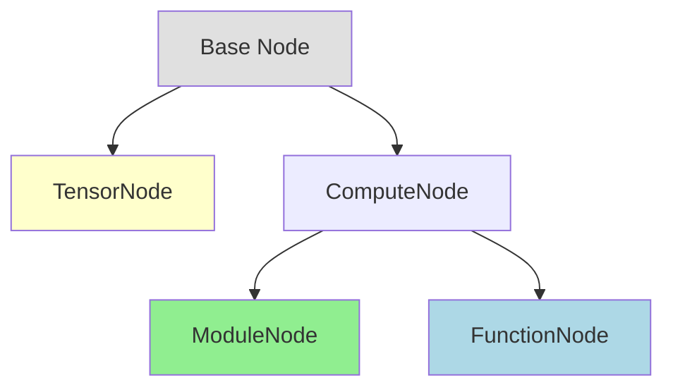

# VODE Stage 3: Node Design Specification

## Node Structure Philosophy

All VODE nodes follow the **INPUT-OP-OUTPUT** horizontal layout pattern with exactly **three columns**.

## Core Layout Principle

```
┌─────────┬──────────────┬─────────┐
│  INPUT  │   OPERATION  │  OUTPUT │
└─────────┴──────────────┴─────────┘
```

**Critical Rules**:

- Exactly 3 columns: LEFT (input) | CENTER (operation) | RIGHT (output)
- NO horizontal lines within the node
- Input/output labels on separate lines from shapes
- Horizontal flow (left to right)
- No dimension labels on arrows between nodes

## Node Type Hierarchy



## Low-Level Nodes

Low-level nodes represent atomic PyTorch operations with concrete tensor shapes.

### Characteristics

- Display actual tensor shapes
- Show input/output ports as dots (●)
- Shapes appear below "input"/"output" labels
- Support click-to-inspect for detailed stats

### Single Input, Single Output

```
┌──────────┬──────────┬──────────┐
│  input   │  ReLU    │  output  │
│    ●     │ depth: 3 │    ●     │
│ (1,3,64) │          │ (1,3,64) │
└──────────┴──────────┴──────────┘
```

## High-Level Nodes

High-level nodes represent user-defined functions or composite modules with dictionary-based inputs/outputs.

### Characteristics

- Display only "input" and "output" labels (no shapes)
- Ports tracked internally
- Shapes accessible via click-to-inspect
- Cleaner, more abstract representation

### User Function Example

```
┌──────────┬──────────────┬──────────┐
│  input   │ compute_loss │  output  │
│          │   depth: 1   │          │
└──────────┴──────────────┴──────────┘
```

### Composite Module Example

```
┌──────────┬──────────────┬──────────┐
│  input   │  ResNetBlock │  output  │
│          │   depth: 2   │          │
└──────────┴──────────────┴──────────┘
```

## Tensor Nodes (Input/Output)

Tensor nodes represent data at graph boundaries.

### Input Tensor

```
┌────────────────────┐
│   input-tensor     │
│   (1, 3, 224, 224) │
│   depth: 0         │
└────────────────────┘
```

### Output Tensor

```
┌────────────────────┐
│  output-tensor     │
│   (1, 1000)        │
│   depth: 0         │
└────────────────────┘
```

## HTML Table Implementation

### Low-Level Node (3 columns, no internal borders)

```html
<TABLE BORDER="0" CELLBORDER="1" CELLSPACING="0" CELLPADDING="6">
<TR>
    <TD BGCOLOR="#F0F0F0">
        input<BR/>
        (1,3,224,224)
    </TD>
    <TD>
        Conv2d<BR/>
        depth: 3
    </TD>
    <TD BGCOLOR="#F0F0F0">
        output<BR/>
        (1,32,224,224)
    </TD>
</TR>
</TABLE>
```

### High-Level Node (3 columns, minimal content)

```html
<TABLE BORDER="0" CELLBORDER="1" CELLSPACING="0" CELLPADDING="6">
<TR>
    <TD BGCOLOR="#F0F0F0">input</TD>
    <TD>compute_loss<BR/>depth: 1</TD>
    <TD BGCOLOR="#F0F0F0">output</TD>
</TR>
</TABLE>
```

### Multiple Inputs/Outputs (compact notation)

```html
<TABLE BORDER="0" CELLBORDER="1" CELLSPACING="0" CELLPADDING="6">
<TR>
    <TD BGCOLOR="#F0F0F0">
        input<BR/>
        3x(1,32,H,W)
    </TD>
    <TD>
        cat<BR/>
        depth: 3
    </TD>
    <TD BGCOLOR="#F0F0F0">
        output<BR/>
        (1,96,H,W)
    </TD>
</TR>
</TABLE>
```

## Interactive Inspection (Web Mode)

When users click on a node in web mode, a detailed inspector panel appears.

### Inspection Data Structure

```typescript
interface NodeInspection {
    name: string;
    type: 'tensor' | 'module' | 'function';
    depth: number;
    
    // For low-level nodes
    inputs?: TensorInfo[];
    outputs?: TensorInfo[];
    
    // For high-level nodes
    inputDict?: Record<string, TensorInfo>;
    outputDict?: Record<string, TensorInfo>;
}

interface TensorInfo {
    varName: string;
    shape: number[];
    dtype: string;
    device: string;
    stats?: {
        min: number;
        max: number;
        mean: number;
        std: number;
        sample: number[];
    };
}
```

### Inspector UI Example

```
┌─────────────────────────────────┐
│ Conv2d (depth: 3)               │
├─────────────────────────────────┤
│ Input:                          │
│   x: (1, 3, 224, 224)          │
│   dtype: float32                │
│   device: cuda:0                │
│   min: -2.117, max: 2.640      │
│   mean: 0.485, std: 0.229      │
│   sample: [0.123, 0.456, ...]  │
│                                 │
│ Output:                         │
│   out: (1, 32, 224, 224)       │
│   dtype: float32                │
│   device: cuda:0                │
│   min: -1.234, max: 3.456      │
│   mean: 0.123, std: 0.567      │
└─────────────────────────────────┘
```

## Port Metadata (Internal)

Ports are tracked internally for edge routing:

```python
class NodePort:
    """Internal port representation (not displayed)"""
    node_id: str
    port_index: int
    port_type: Literal['input', 'output']
    tensor_id: str
    shape: tuple
    
    # For edge connection
    connection_id: str  # Used to match edges
```

## Node Coloring Scheme

```python
NODE_COLORS = {
    'tensor': '#FFFFE0',
    'module': '#C1FFC1',
    'function': '#F0F8FF',
    'input': '#ADD8E6',
    'output': '#F08080'
}
```

## Edge Cases

### Empty Module (Identity)

```
┌──────────┬──────────┬──────────┐
│  input   │ Identity │  output  │
│  (1,64)  │ depth: 3 │  (1,64)  │
└──────────┴──────────┴──────────┘
```

### Scalar Output

```
┌──────────┬──────────┬──────────┐
│  input   │   loss   │  output  │
│ (1,1000) │ depth: 3 │   ()     │
└──────────┴──────────┴──────────┘
```

### No Input (Parameter)

```
┌──────────┬──────────┬──────────┐
│          │ Parameter│  output  │
│          │ depth: 3 │ (64,128) │
└──────────┴──────────┴──────────┘
```

## Python Implementation Example

```python
class NodeBuilder:
    def build_low_level_node(
        self,
        name: str,
        depth: int,
        input_shapes: list[tuple],
        output_shapes: list[tuple]
    ) -> str:
        """Build HTML label for low-level node"""
        
        input_col = f"input<BR/>{self._format_shapes(input_shapes)}"
        op_col = f"{name}<BR/>depth: {depth}"
        output_col = f"output<BR/>{self._format_shapes(output_shapes)}"
        
        return f'''<
            <TABLE BORDER="0" CELLBORDER="1" CELLSPACING="0" CELLPADDING="6">
            <TR>
                <TD BGCOLOR="#F0F0F0">{input_col}</TD>
                <TD>{op_col}</TD>
                <TD BGCOLOR="#F0F0F0">{output_col}</TD>
            </TR>
            </TABLE>>'''
    
    def build_high_level_node(self, name: str, depth: int) -> str:
        """Build HTML label for high-level node"""
        
        return f'''<
            <TABLE BORDER="0" CELLBORDER="1" CELLSPACING="0" CELLPADDING="6">
            <TR>
                <TD BGCOLOR="#F0F0F0">input</TD>
                <TD>{name}<BR/>depth: {depth}</TD>
                <TD BGCOLOR="#F0F0F0">output</TD>
            </TR>
            </TABLE>>'''
    
    def _format_shapes(self, shapes: list[tuple]) -> str:
        """Format shape list compactly"""
        if len(shapes) == 1:
            return str(shapes[0])
        return f"{len(shapes)}x{shapes[0]}"
```

## Summary

VODE's node design prioritizes:

- **Horizontal flow** for natural left-to-right reading
- **3-column structure** for consistency
- **Implicit ports** - tracked internally, not displayed
- **Clear separation** between low-level (with shapes) and high-level (without shapes)
- **Interactive inspection** for detailed information
- **Extensibility** for future enhancements
