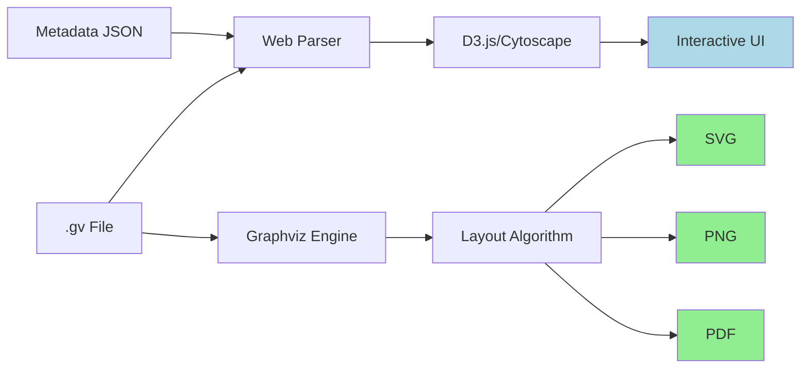

# VODE Stage 3: Rendering Modes

## Overview

VODE supports two rendering modes:

1. **Web Mode**: Interactive visualization in browser
2. **Static Mode**: Export to SVG/PNG/PDF for documents

## Rendering Pipeline



## Web Mode (Interactive)

### Features

**Interactivity**:

- Click nodes to inspect details
- Hover for tooltips
- Zoom and pan
- Filter by depth/type
- Search nodes by name

**Visual Enhancements**:

- Smooth animations
- Highlight on hover
- Connection highlighting
- Collapsible subgraphs

### Technology Stack

```typescript
// Frontend stack
- React 18+ (UI framework)
- TypeScript (type safety)
- D3.js or Cytoscape.js (graph rendering)
- Tailwind CSS (styling)
```

### Implementation

#### 1. Graphviz Parser

```typescript
interface ParsedGraph {
    nodes: Map<string, NodeData>;
    edges: Edge[];
    metadata: GraphMetadata;
}
class GraphvizParser {
    parse(gvContent: string): ParsedGraph {
        // Parse DOT format
        // Extract nodes, edges, attributes
        // Build graph structure
    }
}
```

#### 2. Node Inspector Component

```typescript
interface NodeInspectorProps {
    node: NodeData;
    onClose: () => void;
}

const NodeInspector: React.FC<NodeInspectorProps> = ({ node, onClose }) => {
    return (
        <div className="inspector-panel">
            <h3>{node.name} (depth: {node.depth})</h3>
            
            {node.inputs && (
                <section>
                    <h4>Inputs</h4>
                    {node.inputs.map(input => (
                        <TensorInfo key={input.varName} tensor={input} />
                    ))}
                </section>
            )}
            
            {node.outputs && (
                <section>
                    <h4>Outputs</h4>
                    {node.outputs.map(output => (
                        <TensorInfo key={output.varName} tensor={output} />
                    ))}
                </section>
            )}
        </div>
    );
};
```

#### 3. Graph Visualization Component

```typescript
const GraphView: React.FC<{graph: ParsedGraph}> = ({ graph }) => {
    const [selectedNode, setSelectedNode] = useState<NodeData | null>(null);
    
    useEffect(() => {
        // Initialize D3/Cytoscape
        const cy = cytoscape({
            container: document.getElementById('graph-container'),
            elements: convertToCytoscapeFormat(graph),
            layout: { name: 'dagre', rankDir: 'LR' },
            style: getCytoscapeStyles()
        });
        
        // Handle node clicks
        cy.on('tap', 'node', (evt) => {
            const node = evt.target.data();
            setSelectedNode(node);
        });
    }, [graph]);
    
    return (
        <>
            <div id="graph-container" />
            {selectedNode && (
                <NodeInspector
                    node={selectedNode}
                    onClose={() => setSelectedNode(null)}
                />
            )}
        </>
    );
};
```

### Web Mode Advantages

- **Interactive exploration**: Click to drill down
- **Dynamic filtering**: Show/hide by criteria
- **Real-time updates**: Refresh without reload
- **Rich tooltips**: Hover for quick info
- **Responsive**: Adapts to screen size

## Static Mode (Export)

### Features

**Output Formats**:

- SVG: Scalable, editable
- PNG: Raster, universal
- PDF: Print-ready, professional

**Optimizations**:

- Compact layout
- Print-friendly colors
- Essential information only
- High DPI support

### Implementation

#### Using Graphviz CLI

```bash
# Generate SVG
dot -Tsvg model_dataflow.gv -o model_dataflow.svg

# Generate PNG (high DPI)
dot -Tpng -Gdpi=300 model_dataflow.gv -o model_dataflow.png

# Generate PDF
dot -Tpdf model_dataflow.gv -o model_dataflow.pdf
```

#### Python API

```python
from graphviz import Source

class StaticRenderer:
    def render(self, gv_file: str, output_format: str, output_path: str):
        """Render .gv file to static format"""
        with open(gv_file, 'r') as f:
            gv_content = f.read()
        
        graph = Source(gv_content)
        graph.render(output_path, format=output_format, cleanup=True)
```

### Static Mode Advantages

- **Portable**: Works everywhere
- **Archival**: Long-term storage
- **Print-ready**: For papers/reports
- **No dependencies**: Just image files
- **Fast**: No runtime overhead

## Comparison: Web vs Static

| Feature | Web Mode | Static Mode |
|---------|----------|-------------|
| **Interactivity** | ✅ Full | ❌ None |
| **File Size** | Large (JS bundle) | Small (image) |
| **Load Time** | Slower | Instant |
| **Inspection** | Click to view | Pre-rendered |
| **Portability** | Browser required | Universal |
| **Editing** | No | SVG editable |
| **Print Quality** | Variable | Excellent |

## Rendering Configuration

### Web Mode Config

```typescript
interface WebRenderConfig {
    layout: 'dagre' | 'cose' | 'breadthfirst';
    direction: 'LR' | 'TB' | 'RL' | 'BT';
    nodeSpacing: number;
    edgeStyle: 'bezier' | 'straight' | 'taxi';
    enableZoom: boolean;
    enablePan: boolean;
    showMinimap: boolean;
}
```

### Static Mode Config

```python
@dataclass
class StaticRenderConfig:
    format: Literal['svg', 'png', 'pdf']
    dpi: int = 300
    size: tuple[int, int] | None = None
    bgcolor: str = 'white'
    rankdir: Literal['LR', 'TB', 'RL', 'BT'] = 'LR'
```

## Performance Considerations

### Web Mode

- **Large graphs**: Use virtualization
- **Many nodes**: Implement LOD (Level of Detail)
- **Animations**: Use requestAnimationFrame
- **Memory**: Clean up on unmount

### Static Mode

- **Large graphs**: May timeout, use chunking
- **High DPI**: Increases file size
- **Complex layouts**: Longer render time
- **Memory**: Graphviz can be memory-intensive

## Extensibility

### Custom Renderers

```python
class CustomRenderer:
    def render(self, graph: Graph, config: RenderConfig) -> Output:
        """Implement custom rendering logic"""
        pass

# Register custom renderer
RENDERERS['custom'] = CustomRenderer()
```

### Plugin System

```typescript
interface RenderPlugin {
    name: string;
    init(graph: ParsedGraph): void;
    render(container: HTMLElement): void;
    destroy(): void;
}

// Register plugin
registerPlugin(new CustomLayoutPlugin());
```

## Summary

VODE's dual rendering approach provides:

- **Flexibility**: Choose mode based on use case
- **Quality**: High-quality output in both modes
- **Extensibility**: Easy to add new renderers
- **Performance**: Optimized for each mode
